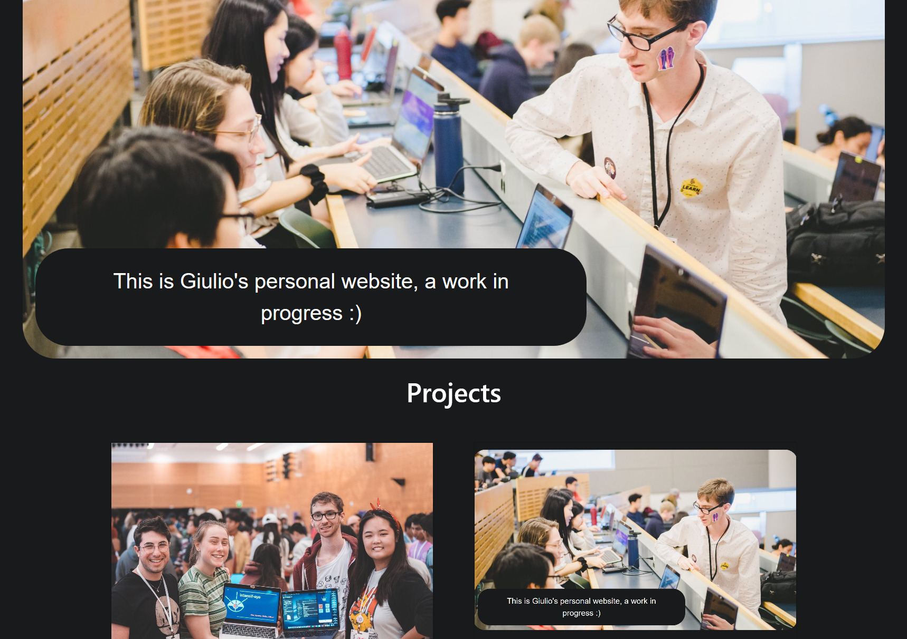

The site you're on right now. It has had two lives:

**2019 — Nuxt.** The original was a Nuxt 2 single-page app styled with Buefy, with
project pages rendered from markdown via `frontmatter-markdown-loader`. It served
faithfully for years.

**2026 — Astro.** Rebuilt from scratch as a fully static site: zero client-side
framework, type-checked content collections for the project pages, build-time image
optimization, and a hand-rolled design system in plain CSS. Still deployed the same
way it always was — built to `docs/` and served by GitHub Pages.

## Tech stack

- [Astro 5](https://astro.build/) with content collections
- Plain CSS with design tokens — no framework
- Self-hosted fonts, build-time optimized images
- [GitHub Pages](https://pages.github.com/) hosting
